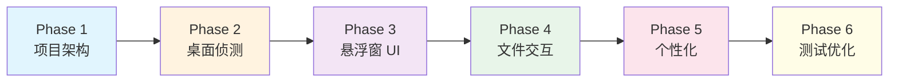

# HoverPortal - Windows 桌面悬停预览插件实施计划

为 Windows 桌面打造丝滑的文件夹悬停预览工具，采用 C#/.NET 8/WPF 技术栈，实现弹簧物理动画与深度系统集成。

---

## User Review Required

> [!IMPORTANT]
> **开发环境确认**: 请确认您的开发环境已安装 Visual Studio 2022 (17.8+) 和 .NET 8 SDK。

> [!WARNING]
> **系统权限**: 本项目需要访问 Explorer 进程内存（用于获取桌面图标位置），可能触发杀毒软件警告。请确认可接受此技术方案。

---

## Proposed Changes

按照 workflow 定义的 **"思索-调研-存证-执行"** 闭环模式，分阶段实施：

---

### Phase 1: 项目架构搭建 (Foundation)

#### [NEW] [HoverPortal.sln](file:///d:/Desktop/work_space/HoverPortal/HoverPortal.sln)
- 创建 .NET 8 WPF 解决方案

#### [NEW] [src/HoverPortal/HoverPortal.csproj](file:///d:/Desktop/work_space/HoverPortal/src/HoverPortal/HoverPortal.csproj)
- 主项目配置
- NuGet 依赖:
  - `CommunityToolkit.Mvvm` (MVVM 框架)
  - `Microsoft.Windows.CsWin32` (P/Invoke 签名生成)
  - `WPF-UI` 或 `HandyControl` (现代化 UI 控件)

#### [NEW] [src/HoverPortal/App.xaml](file:///d:/Desktop/work_space/HoverPortal/src/HoverPortal/App.xaml)
- 应用程序入口
- 资源字典配置
- 启动窗口绑定

---

### Phase 2: 桌面侦测模块 (Desktop Hook & Detection)

#### [NEW] [src/HoverPortal/Services/DesktopIconService.cs](file:///d:/Desktop/work_space/HoverPortal/src/HoverPortal/Services/DesktopIconService.cs)
- **核心功能**: 获取桌面图标位置与路径映射
- **关键实现**:
  ```csharp
  // 通过 FindWindow 链获取桌面 ListView 句柄
  // Progman -> SHELLDLL_DefView -> SysListView32
  // 或 WorkerW -> SHELLDLL_DefView -> SysListView32 (Win11)
  ```
- **跨进程操作**: 使用 `VirtualAllocEx` + `LVM_GETITEMRECT` 读取图标坐标

#### [NEW] [src/HoverPortal/Services/MouseHoverDetector.cs](file:///d:/Desktop/work_space/HoverPortal/src/HoverPortal/Services/MouseHoverDetector.cs)
- **鼠标监控**: 高性能定时器轮询 (`GetCursorPos`)
- **悬停逻辑**: 200-500ms 阈值可配置
- **防误触**: 微小移动容忍范围

#### [NEW] [src/HoverPortal/Interop/NativeMethods.cs](file:///d:/Desktop/work_space/HoverPortal/src/HoverPortal/Interop/NativeMethods.cs)
- 使用 `CsWin32` 生成的安全 P/Invoke 签名
- `SafeHandle` 封装非托管资源

---

### Phase 3: 悬浮窗 UI 模块 (Visual & Animation)

#### [NEW] [src/HoverPortal/Views/PreviewWindow.xaml](file:///d:/Desktop/work_space/HoverPortal/src/HoverPortal/Views/PreviewWindow.xaml)
- 透明无边框窗口 (`WindowStyle="None"`, `AllowsTransparency="True"`)
- 圆角边框 + 阴影效果
- 智能网格布局容器

#### [NEW] [src/HoverPortal/ViewModels/PreviewViewModel.cs](file:///d:/Desktop/work_space/HoverPortal/src/HoverPortal/ViewModels/PreviewViewModel.cs)
- MVVM ViewModel
- 文件列表 `ObservableCollection<FileItem>`
- 命令绑定 (OpenFile, OpenFolder)

#### [NEW] [src/HoverPortal/Animations/SpringAnimationHelper.cs](file:///d:/Desktop/work_space/HoverPortal/src/HoverPortal/Animations/SpringAnimationHelper.cs)
- **Composition API 动画**: GPU 加速的弹簧阻尼效果
- **性能目标**: 60 FPS 稳定
- 展开/收缩动画曲线

#### [NEW] [src/HoverPortal/Effects/AcrylicEffect.cs](file:///d:/Desktop/work_space/HoverPortal/src/HoverPortal/Effects/AcrylicEffect.cs)
- `DwmSetWindowAttribute` 启用 Mica/Acrylic 效果
- Win10/Win11 兼容性处理

---

### Phase 4: 文件系统与交互模块 (FileSystem & Interaction)

#### [NEW] [src/HoverPortal/Services/FileSystemService.cs](file:///d:/Desktop/work_space/HoverPortal/src/HoverPortal/Services/FileSystemService.cs)
- 异步文件夹内容读取 (`async/await`)
- 缓存机制防止重复读取

#### [NEW] [src/HoverPortal/Services/IconExtractor.cs](file:///d:/Desktop/work_space/HoverPortal/src/HoverPortal/Services/IconExtractor.cs)
- `SHGetFileInfo`: 系统关联图标
- `IShellItemImageFactory`: 图片/视频缩略图
- 图标缓存 (内存 + 磁盘)

#### [NEW] [src/HoverPortal/Behaviors/DragDropBehavior.cs](file:///d:/Desktop/work_space/HoverPortal/src/HoverPortal/Behaviors/DragDropBehavior.cs)
- WPF 拖拽附加行为
- 拖出到外部应用
- 拖入触发预览展开

---

### Phase 5: 个性化与设置 (Customization)

#### [NEW] [src/HoverPortal/Views/SettingsWindow.xaml](file:///d:/Desktop/work_space/HoverPortal/src/HoverPortal/Views/SettingsWindow.xaml)
- 系统托盘图标入口
- 悬停延迟滑块
- 动画预设选择 (极速/均衡/优雅)
- 外观定制 (圆角、透明度、颜色)

#### [NEW] [src/HoverPortal/Models/AppSettings.cs](file:///d:/Desktop/work_space/HoverPortal/src/HoverPortal/Models/AppSettings.cs)
- 配置数据模型
- JSON 序列化存储

---

## 项目结构预览

```
HoverPortal/
├── doc/
│   ├── 用户需求.md
│   └── 技术文档.md
├── src/
│   └── HoverPortal/
│       ├── Animations/
│       │   └── SpringAnimationHelper.cs
│       ├── Behaviors/
│       │   └── DragDropBehavior.cs
│       ├── Effects/
│       │   └── AcrylicEffect.cs
│       ├── Interop/
│       │   └── NativeMethods.cs
│       ├── Models/
│       │   └── AppSettings.cs
│       ├── Services/
│       │   ├── DesktopIconService.cs
│       │   ├── FileSystemService.cs
│       │   ├── IconExtractor.cs
│       │   └── MouseHoverDetector.cs
│       ├── ViewModels/
│       │   ├── MainViewModel.cs
│       │   └── PreviewViewModel.cs
│       ├── Views/
│       │   ├── PreviewWindow.xaml
│       │   └── SettingsWindow.xaml
│       ├── App.xaml
│       ├── App.xaml.cs
│       └── HoverPortal.csproj
├── tests/
│   └── HoverPortal.Tests/
│       ├── Services/
│       │   └── DesktopIconServiceTests.cs
│       └── HoverPortal.Tests.csproj
└── HoverPortal.sln
```

---

## Verification Plan

### Automated Tests

#### 单元测试 (xUnit)
```bash
# 运行所有测试
dotnet test tests/HoverPortal.Tests/HoverPortal.Tests.csproj

# 运行特定模块测试
dotnet test --filter "FullyQualifiedName~DesktopIconService"
```

**测试覆盖范围**:
- `DesktopIconService`: 窗口句柄查找逻辑 (Mock 模式)
- `FileSystemService`: 异步文件读取
- `MouseHoverDetector`: 坐标命中检测算法

### Manual Verification

#### 1. 基础功能验证
| 步骤 | 操作 | 预期结果 |
|------|------|----------|
| 1 | 启动应用程序 | 系统托盘出现图标，无窗口弹出 |
| 2 | 鼠标悬停在桌面文件夹 300ms | 流畅的弹簧动画展开预览面板 |
| 3 | 鼠标移出预览面板 | 平滑收缩动画关闭面板 |
| 4 | 单击预览面板中的文件 | 使用默认程序打开该文件 |
| 5 | 中键点击文件夹 | 打开资源管理器到该目录 |

#### 2. 性能验证
| 指标 | 目标值 | 测试方法 |
|------|--------|----------|
| 内存占用 | < 50 MB | 任务管理器监控 |
| 动画帧率 | ≥ 60 FPS | 使用 Windows Performance Analyzer |
| CPU 空闲占用 | < 1% | 任务管理器监控 |

#### 3. 兼容性验证
| 环境 | 测试项 |
|------|--------|
| Windows 11 (23H2) | Mica 效果、窗口结构检测 |
| Windows 10 (22H2) | Acrylic 降级效果 |
| 4K @ 200% 缩放 | 图标清晰度、坐标转换正确性 |
| 多显示器 | 跨屏幕图标定位 |

---

## 开发顺序建议



> [!TIP]
> 建议先完成 Phase 2 的核心侦测逻辑 (DesktopIconService)，确保能稳定获取图标位置后，再进行 UI 开发。这是整个项目的技术风险点。
